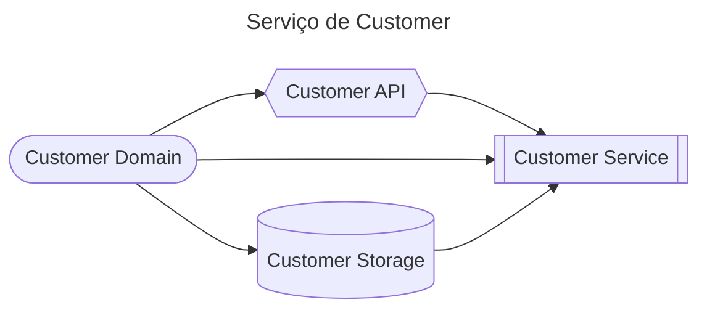
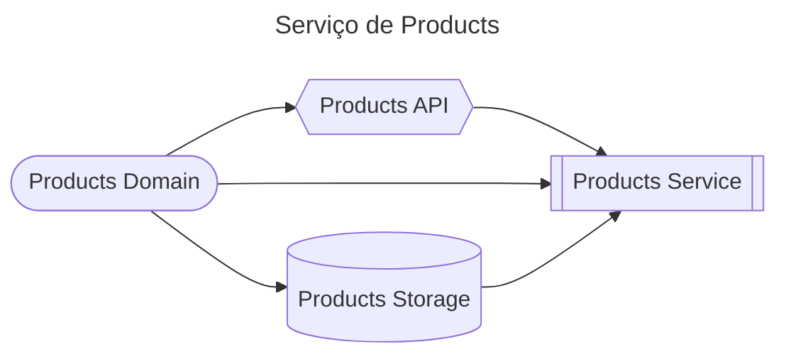
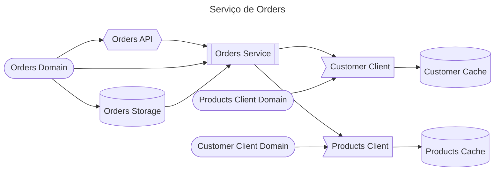
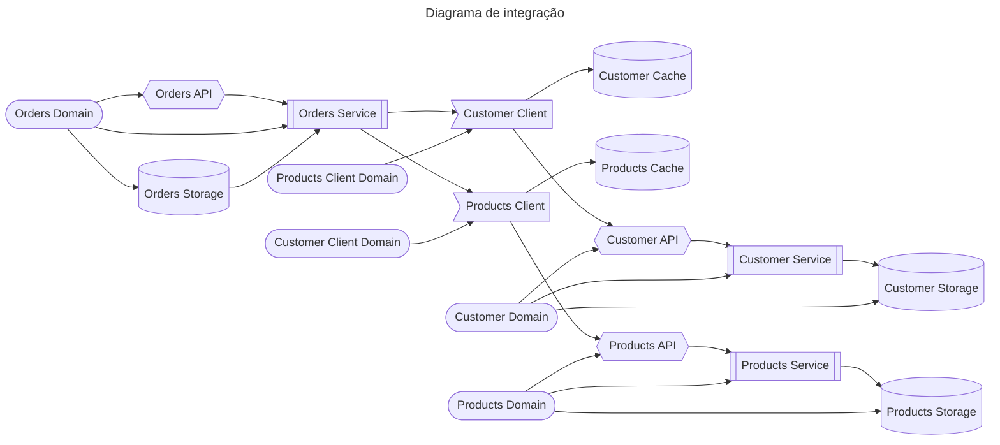

# plataforma-hackathon

## Intro
Esse prjeto foi criado como a intenção de ser educativo e realizado com 3 times diferentes, cada um lidando com uma parte do projeto.

## Parte 1: Customer e Products (nível básico)
### Customer - Time 1
Precisa deixar o projeto funcionando para seus clientes, existem vários pontos que devem ser implementados no código para que ele atenda as chamadas

Vocês serão responsáveis por entregar os dados de produtos para a aplicação de Orders.

### Products - Time 2
Muito parecido com o projeto de Customer, é preciso implementar parte das integrações com SQL, melhorar alguns pontos, todos descritos no começo de cada arquivo fonte. 

Vocês serão responsáveis por entregar os dados de produtos para a aplicação de Orders.

## Parte 2: Orders (nível intermediário)
Nesse projeto além de ter que implementar alguns pontos que estão faltando, ainda é preciso consumnir dados dos outros dois projetos, Customer e Products. Sem eles, essa API não vai funcionar corretamente.

## Visão geral

